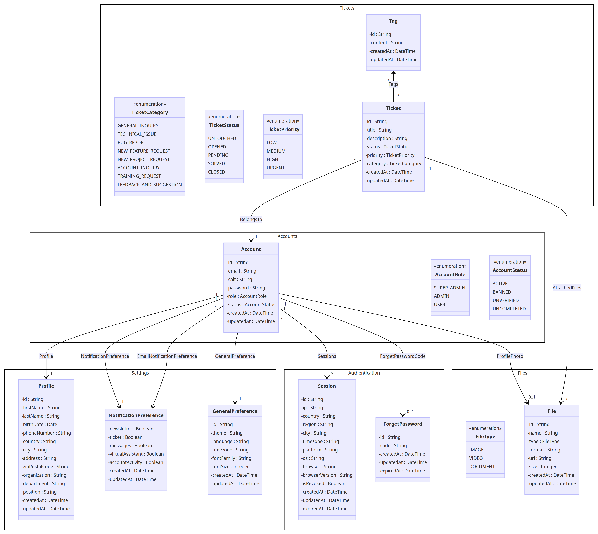
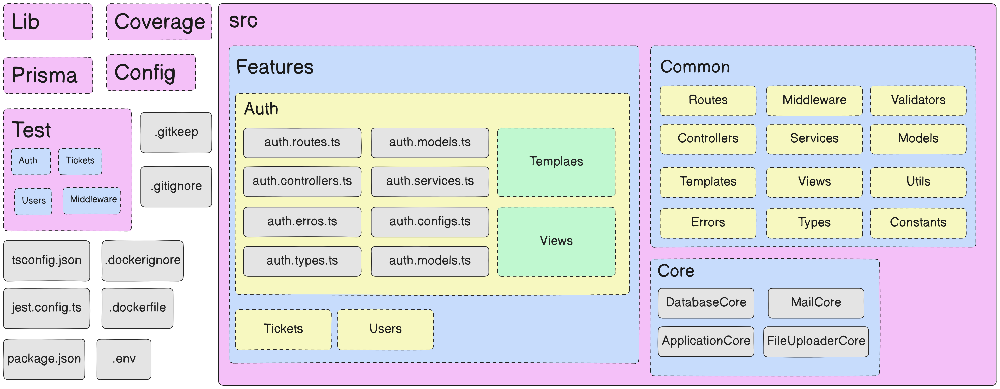
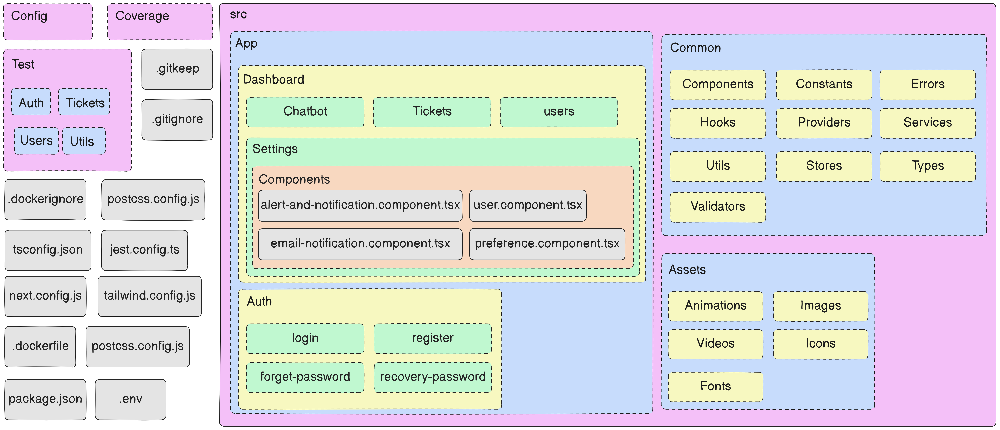

## I-   Overview
### A- Features :

1.  **Account Management**:
    
    *   User registration, login, and logout.
    *   Password recovery and reset mechanisms.
    *   User profile management.
2.  **Ticket Management**:
    
    *   Create, view, update, and close support or service tickets.
    *   Prioritize and categorize tickets.
    *   Assign tickets to specific team members.
3.  **Sessions Management**:
    
    *   Implement secure session handling and storage.
    *   Allow users to view active sessions and log them out remotely.
4.  **Virtual Assistant**:
    
    *   Implement a chatbot or AI-driven virtual assistant to provide automated customer support.
5.  **Notifications**:
    
    *   Send notifications to users via email
    *   Allow users to customize their notification preferences.
6.  **Permission**:
    
    *   Define and manage user roles and permissions.
    *   Implement role-based access control (RBAC) for various parts of the application.
7. **User Management**
   1. 

### B- Design and Architecture:

1.  **Advanced Folder Architecture**:
    
    *   Organize your application into modules or components for better maintainability.
2.  **Strong Architecture (MVC + Multi Layer)**:
    
    *   Follow the Model-View-Controller (MVC) architecture for clear separation of concerns.
    *   Implement additional layers such as service and repository layers for better code organization.
3.  **Design Pattern Like (Singleton)**:
    
    *   Use design patterns like Singleton, Factory, or Dependency Injection where appropriate.
4.  **Configurable Application**:
    
    *   Store configuration parameters in a centralized configuration file.
    *   Allow configuration to be easily updated without modifying code.
5.  **Design**:
    
    *   Implement a user-friendly and responsive design for a positive user experience.

### C- Security:

1.  **Authorization/Permission (roles & token)**:
    
    *   Implement role-based access control (RBAC) and token-based authentication.
    *   Ensure that users can only access resources they are authorized for.
2.  **Sessions/Tokens Controls**:
    
    *   Manage token expiration, refresh tokens, and implement token revocation.
    *   Provide notifications for important security-related actions (e.g., new login from a new device).
3.  **CORS: Allow/Block Domains**:
    
    *   Configure Cross-Origin Resource Sharing (CORS) to control which domains are allowed to access your API.
4.  **Rate Limiter**:
    
    *   Implement rate limiting to prevent abuse and DDoS attacks.
5.  **Validation and Sanitization**:
    
    *   Validate and sanitize user inputs to prevent common security vulnerabilities.
6.  **Fix Security Vulnerabilities**:
    
    *   Regularly update dependencies to address known vulnerabilities.
    *   Implement measures to prevent HTTP Parameter Pollution, XSS, clickjacking, and CSRF attacks.

### D- Best Practice:

1.  **Clean Code**:
    
    *   Follow clean coding practices such as meaningful variable names, proper indentation, and well-organized code structure.
2.  **Error & Exception Handling**:
    
    *   Implement comprehensive error handling with informative error messages.
    *   Use try-catch blocks to handle exceptions gracefully.

## II-  Setup & Installation
### A-  Requirements
1. [NodeJS](https://nodejs.org/) runtime v18.17.0:
   - NodeJS is the JavaScript runtime required to run the front/backend of the help desk app.

   **Installation:**
   1. Visit the NodeJS website: https://nodejs.org/
   2. Download the v18.17.0 LTS version for your operating system.
   3. Run the installer and follow the on-screen instructions.
   4. To verify the installation, open your terminal and run:
      ```
      node -v
      npm -v
      ```

2. [Xampp](https://www.apachefriends.org/) v8.2.4:
   - Xampp provides the necessary server environment for running the frontend of the help desk app.

   **Installation:**
   1. Visit the Xampp website: https://www.apachefriends.org/
   2. Download the v8.2.4 version for your operating system.
   3. Run the installer and follow the on-screen instructions.
   4. Start the Apache and MySQL services from the Xampp control panel.
   5. To verify the installation, open your web browser and navigate to `http://localhost`.
### B-  Installation
1. Clone the repository or download the latest release.
```shell
git clone https://github.com/NassimBenNsib/HelpDesk-NextJS-ExpressJS-MySQL.git
```
#### 1- Server :
##### a- Setup
```shell
# 1. Navigate to the app's directory.
cd HelpDesk-NextJS-ExpressJS-MySQL/backend/server

# 2. Install dependencies:
# Choose one of the following commands based on your package manager preference.
npm install
# or
yarn install
# or
pnpm install

# 3. Configure environment variables: 
# Copy `.env.example` to `.env` and set necessary values.
cp .env.example .env
# Open `.env` in a text editor and fill in the required values.

# 4. Start the app.
# Use one of the following commands to run the app in development mode.
npm run run:dev:full
# or
yarn run:dev:full

```

##### b- Configuration

###### b1-  Application
```dosini
# Your company's logo, name, address, and contact details
SERVER_COMPANY_LOGO=""
SERVER_COMPANY_NAME=""
SERVER_COMPANY_ADDRESS=""
SERVER_COMPANY_PHONE=""
SERVER_COMPANY_EMAIL=""
SERVER_COMPANY_WEBSITE=""
SERVER_COMPANY_LINKEDIN=""
SERVER_COMPANY_FACEBOOK=""
SERVER_COMPANY_SUPPORT_EMAIL=""
SERVER_COMPANY_SUPPORT_PHONE=""

# The name, version, protocol, host, and port of the app
SERVER_APP_NAME=""
SERVER_APP_VERSION=""
SERVER_APP_PROTOCOL=""
SERVER_APP_HOST=""
SERVER_APP_PORT=""
SERVER_APP_BASE_URL=""

# configurations of app mode
# The mode (development or production) and debugging status
SERVER_APP_MODE="developement"  # Note: There's a typo here, should be "development" instead of "developement"
SERVER_APP_DEBUG=""
```
###### b2- Security
```dosini
#########################################################################
################################ SECURITY ##################################
#########################################################################

# configurations of JWT
# JSON Web Token settings
SERVER_JWT_SECRET_KEY=""
SERVER_JWT_EXPIRES_IN="" # n milliseconds = m days
SERVER_JWT_ALGORITHM="" # 0: HS256, 1: HS384, 2: HS512
SERVER_JWT_NUMBER_OF_CYCLES="" # number of cycles to generate a new token

# configurations of session
# Session settings
SERVER_SESSION_SECRET_KEY=""
SERVER_SESSION_EXPIRES_IN="" # n milliseconds = m days
SERVER_SESSION_ALGORITHM="" # 0: HS256, 1: HS384, 2: HS512

# configurations of forgot password
# Forgot password settings
SERVER_FORGOT_PASSWORD_EXPIRES_IN="" # n milliseconds = m hour
```
###### b3- API
```dosini
#########################################################################
################################# API ####################################
#########################################################################

# configurations of api
# API settings
SERVER_API_PREFIX=""
SERVER_API_VERSION=""
SERVER_API_BASE_URL=""

# configurations of api docs
# API documentation settings
SERVER_API_DOCS_PREFIX=""
SERVER_API_DOCS_VERSION=""
SERVER_API_DOCS_BASE_URL=""
```
###### b4- Database
```dosini
#########################################################################
############################# DATABASE ##################################
#########################################################################

# configurations of DATABASE
# Database connection settings
SERVER_DATABASE_PROTOCOL=""
SERVER_DATABASE_HOST=""
SERVER_DATABASE_PORT=""
SERVER_DATABASE_USER=""
SERVER_DATABASE_PASSWORD=""
SERVER_DATABASE_DATABASE=""
SERVER_DATABASE_BASE_URL=""

# configurations of cache
# Cache connection settings
SERVER_CACHE_PROTOCOL=""
SERVER_CACHE_HOST=""
SERVER_CACHE_PORT=""
SERVER_CACHE_USER=""
SERVER_CACHE_PASSWORD=""
SERVER_CACHE_DATABASE=""
SERVER_CACHE_PREFIX=""
SERVER_CACHE_BASE_URL=""
```
###### b5- Services
```dosini
#########################################################################
############################# SERVICES ##################################
#########################################################################

# configurations of mail
# Email service settings
SERVER_EMAIL_PROTOCOL=""
SERVER_EMAIL_HOST=""
SERVER_EMAIL_PORT=""
SERVER_EMAIL_SECURE=""
SERVER_EMAIL_USER=""
SERVER_EMAIL_PASSWORD=""
```

######  b6- Uploader
```dosini
#############################################################################
############################# FILE UPLOAD ###################################
#############################################################################
# File upload settings for various types

# Cloud storage settings
SERVER_FILE_UPLOAD_FILES_CLOUD_NAME=""
SERVER_FILE_UPLOAD_API_KEY=""
SERVER_FILE_UPLOAD_API_SECRET=""

# Documents upload settings
SERVER_FILE_UPLOAD_DOCUMENTS_FOLDER="documents"
SERVER_FILE_UPLOAD_DOCUMENTS_MAX_SIZE="10 * 1024 * 1024" # 10 MB
SERVER_FILE_UPLOAD_DOCUMENTS_ALLOWED_EXTENSIONS="['pdf', 'doc', 'docx', 'xls', 'xlsx', 'ppt', 'pptx', 'txt','csv','odt']"

# Images upload settings
SERVER_FILE_UPLOAD_IMAGES_FOLDER="images"
SERVER_FILE_UPLOAD_IMAGES_MAX_SIZE="2 * 1024 * 1024" # 2 MB
SERVER_FILE_UPLOAD_IMAGES_ALLOWED_EXTENSIONS="['png', 'jpg', 'jpeg', 'gif']"

# Audios upload settings
SERVER_FILE_UPLOAD_AUDIOS_FOLDER="audios"
SERVER_FILE_UPLOAD_AUDIOS_MAX_SIZE="10 * 1024 * 1024" # 10 MB
SERVER_FILE_UPLOAD_AUDIOS_ALLOWED_EXTENSIONS="['mp3', 'wav', 'wma', 'aac', 'flac']"

# Videos upload settings
SERVER_FILE_UPLOAD_VIDEOS_FOLDER="videos"
SERVER_FILE_UPLOAD_VIDEOS_MAX_SIZE="50 * 1024 * 1024" # 50 MB
SERVER_FILE_UPLOAD_VIDEOS_ALLOWED_EXTENSIONS="['mp4', 'mov', 'avi', 'wmv', 'flv', 'mkv', 'webm']"
```

##### c- Scripts

###### c1- Init Scripts
- `[init]`: A visual separator for the init section.
- `run:init:full`: Initializes both the Jest testing framework and the Prisma database client.
- `run:init:database`: Initializes the Prisma database client.

###### c2- Test Scripts
- `[test]`: A visual separator for the test section.
- `run:jest`: Executes Jest tests.
- `run:test:full`: Executes Jest tests with various options including watching, verbose output, coverage tracking, handling open handles, and running in a single thread.

###### c3- Migrate Scripts
- `[migrate]`: A visual separator for the migrate section.
- `run:migrate:database`: Performs migration of the Prisma database with the "init" name.
- `run:migrate:model`: Generates Prisma models.
- `run:migrate:full`: Combines migration of the Prisma database and generation of models using the "init" name.

###### c4- Development Scripts
- `[dev]`: A visual separator for the development section.
- `run:dev`: Launches the application in development mode using ts-node-dev with transpilation and respawn.
- `run:dev:full`: Integrates migration, model generation, and running the app for development.

###### c5- Build Scripts
- `[build]`: A visual separator for the build section.
- `run:build`: Compiles TypeScript files using the TypeScript compiler (tsc).
- `run:build:full`: Same as run:build.

###### c6- Production Scripts
- `[production]`: A visual separator for the production section.
- `run:prod:full`: Initiates the compiled application in production mode.
- `run:prod`: Same as run:prod:full.

###### c7-Tools Scripts
- `[tools]`: A visual separator for the tools section.
- `run:prisma:studio`: Launches Prisma Studio for visual database management.

##### d- Screenshot

#### 2- Chatbot :
##### a- Setup
```shell
# 1. Navigate to the app's directory.
cd HelpDesk-NextJS-ExpressJS-MySQL/backend/chatbot

# 2. Install dependencies:
# Choose one of the following commands based on your package manager preference.
npm install
# or
yarn install
# or
pnpm install

# 3. Configure environment variables: 
# Copy `.env.example` to `.env` and set necessary values.
cp .env.example .env
# Open `.env` in a text editor and fill in the required values.

# 4. Start the app.
# Use one of the following commands to run the app in development mode.
npm run run:dev:full
# or
yarn run:dev:full

```

##### b- Configuration

```dosini
################################ APP ####################################
#########################################################################

#configuration of company
# The company logo, name, address, and contact details
COMPANY_LOGO=""
COMPANY_NAME=""
COMPANY_ADDRESS=""
COMPANY_PHONE=""
COMPANY_EMAIL=""
COMPANY_WEBSITE=""
COMPANY_LINKEDIN=""
COMPANY_FACEBOOK=""
COMPANY_SUPPORT_EMAIL=""
COMPANY_SUPPORT_PHONE=""

# configurations of app
# The name, version, protocol, host, and port of the app
APP_NAME=""
APP_VERSION="1.0.0"
APP_PROTOCOL="http"
APP_HOST="0.0.0.0"
APP_PORT="9000"
APP_BASE_URL="http://localhost:9000"

# configurations of app mode
# The mode (development or production) and debugging status
APP_MODE=""
APP_DEBUG="true"

#########################################################################
################################ API ####################################
#########################################################################
# API prefix, version, and base URL
API_PREFIX="/api/"
API_VERSION="v1"
API_BASE_URL="http://localhost:9000/api/v1"

#########################################################################
################################ CORS ###################################
#########################################################################
# Cross-Origin Resource Sharing (CORS) settings
CORS_ORIGINS="*"
CORS_METHODS="*"
CORS_ALLOWED_HEADERS="*"
CORS_ALLOWED_METHODS="*"

#########################################################################
##########################  OPEN_AI     #################################
# OpenAI API key for integration
OPENAI_API_KEY=''
```
##### c- Screenshot

#### 3- Client
##### a- Setup
```shell
# 1. Navigate to the app's directory.
cd HelpDesk-NextJS-ExpressJS-MySQL/frontend/client

# 2. Install dependencies:
# Choose one of the following commands based on your package manager preference.
npm install
# or
yarn install
# or
pnpm install

# 3. Configure environment variables: 
# Copy `.env.example` to `.env` and set necessary values.
cp .env.example .env.local
# Open `.env` in a text editor and fill in the required values.

# 4. Start the app.
# Use one of the following commands to run the app in development mode.
npm run run:dev:full
# or
yarn run:dev:full

```
##### b- Configuration

```dosini
# ================ Frontend (Client Side) environment variables ================

# API environment variables
NEXT_PUBLIC_BACKEND_API_PROTOCOL=
NEXT_PUBLIC_BACKEND_API_BASE_URL=
NEXT_PUBLIC_BACKEND_API_PORT=
NEXT_PUBLIC_BACKEND_API_PREFIX=
NEXT_PUBLIC_BACKEND_API_VERSION=

# Database environment variables

# Application variables
NEXT_PUBLIC_MODE=
```
##### c- Screenshot


## III- Architecture & UML

### UML
#### Use Case Diagram

#### Entity Relationship Diagram 

#### Entity Relationship Details Diagram 


### Folder Structure
#### Backend

#### Frontend


## IV- Tools
-   Development
    -   [VS Code](https://code.visualstudio.com/)
    -   Frontend
        -   [ReactJS](https://react.dev/)
        -   [NextJS](https://nextjs.org/)
        -   [Typescript](https://www.typescriptlang.org/)
        -   [TailwindCSS](https://tailwindcss.com/)
        -   [Shadcn/ui](https://ui.shadcn.com/)
    -   Backend
        -   [NodeJS](https://nodejs.org/)
        -   [ExpressJS](https://expressjs.com/)
        -   [Typescript](https://www.typescriptlang.org/)
        -   [Open API](https://openai.com/) (ChatGPT) 
-   Versioning
    -   [GitHub](https://github.com/)
    -   [Git](https://git-scm.com/)
-   Database
    -   [MySQL](https://www.mysql.com/)
    -   [Prisma](https://www.prisma.io/)
    -   [Prisma Studio](https://www.prisma.io/studio)
- Testing
  - [REST Client](https://marketplace.visualstudio.com/items?itemName=humao.rest-client) (VS Code Extension) 
  - [Jest](https://jestjs.io/)
-   Project Management & Collaboration
    -   [Trello](https://trello.com/)
    -   [Google Meet](https://meet.google.com/)
- Documentation
    - [Mermaid](https://mermaid.js.org/) (Language & Editor )
            - Diagrams (class diagram, git graph, entity relationship)
    - [Draw.io](https://draw.io/) (use case diagrams)
    - [UML](https://www.uml.org/)