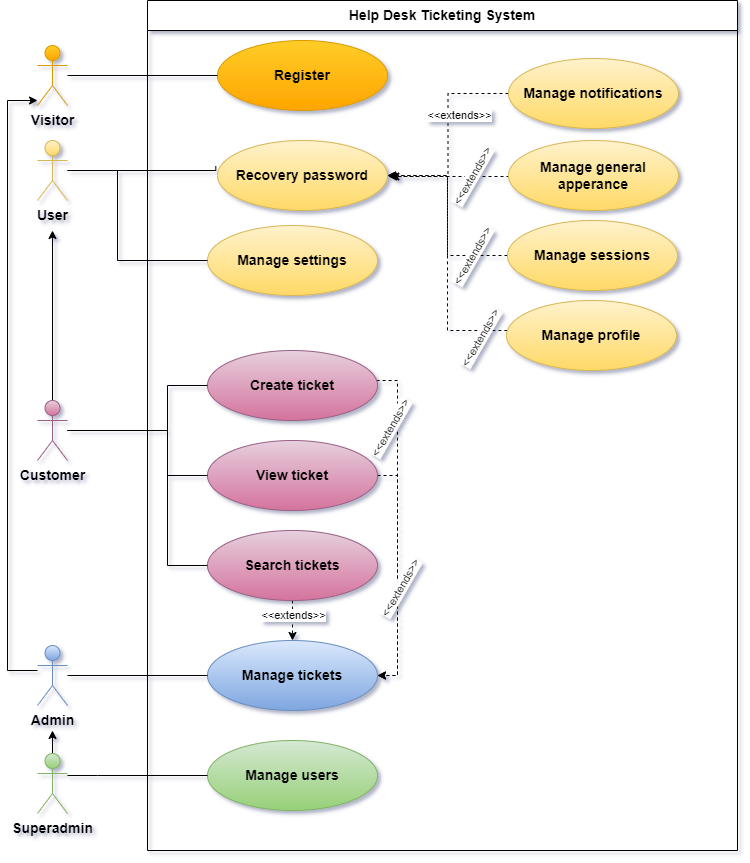
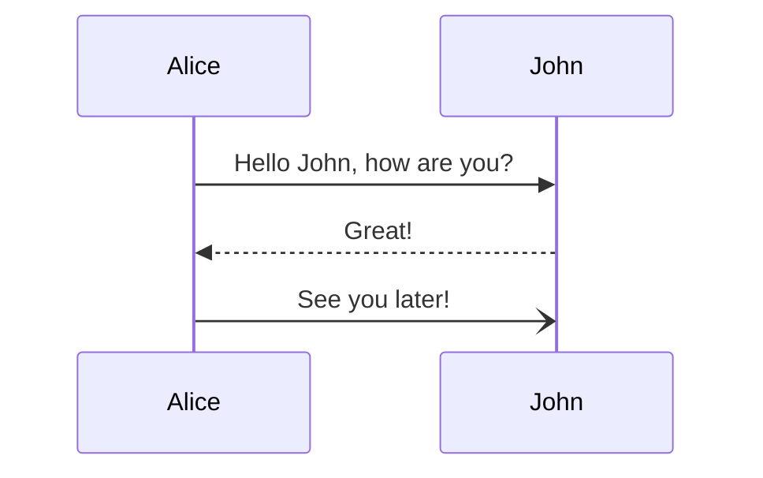

## X.Y Diagrammes des cas d’utilisation

> 

### X.Y.1 Description textuelle du cas d’utilisation « Gestion des utilisateurs» :

> 
> 
> **Tableau x.y.1** Description textuelle du cas d’utilisation « Gestion des utilisateurs »
> 
> **Titre** : Gestion des utilisateurs
> 
> **Acteur** : Superadmin
> 
> **Description** :
> 
> > Ce cas d'utilisation représente le processus de gestion des utilisateurs au sein de la plateforme. L'administrateur à la responsabilité de créer, mettre à jour, et supprimer les comptes des utilisateurs, ainsi que de gérer leurs rôles au sein du système.
> 
> **Pré-conditions** :
> 
> - Le superadmin est authentifié et a les autorisations nécessaires pour gérer les utilisateurs.
> 
> - Il doit accéder à l’interface de gestion des utilisateurs.        
> 
> **Postconditions**:
> 
> - Les modifications relatives aux utilisateurs, comme la création, la mise à jour ou la suppression de comptes, ainsi que les ajustements des autorisations et des rôles, sont enregistrées dans le système.
> 
> **Scénario nominal**
> 
> 1. L'administrateur accède à l'interface de gestion des utilisateurs.
> 2. Le système affiche la liste des utilisateurs existants.
> 3. L'administrateur peut sélectionner un utilisateur pour afficher ses détails.
> 4. L'administrateur a la possibilité de créer un nouvel utilisateur en fournissant les informations nécessaires.
> 5. L'administrateur peut modifier les détails d'un utilisateur existant.
> 6. L'administrateur peut attribuer un rôle spécifique à un utilisateur.
> 7. L'administrateur peut supprimer un utilisateur du système.
> 
> **Scénario alternatif**:
> 
> - À tout moment, l'utilisateur peut annuler une opération en cours ou revenir en arrière pour effectuer des modifications.
> 
> **Exceptions**:
> 
> - Si des champs obligatoires ne sont pas renseignés lors de la création ou de la mise à jour d'un utilisateur, le système affiche un message d'erreur et empêche la validation de l'opération.
> - Si l'administrateur tente de créer ou de mettre à jour un utilisateur avec une adresse e-mail déjà existante, le système affiche un message d'erreur et empêche l'action, demandant à l'administrateur de choisir une adresse e-mail unique.
> - Si la session de l'administrateur expire pendant une opération, le système affiche un message d'erreur indiquant que la session a expiré et redirige l'administrateur vers la page d'authentification pour se reconnecter. 

### X.Y.2 Description textuelle du cas d’utilisation « Gestion des paramètres » :

> 
> 
> **Tableau x.y.1** Description textuelle du cas d’utilisation « Gestion des paramètres »
> 
> **Titre** : Gestion des paramètres
> 
> **Acteur** : Utilisateur
> 
> **Description** :
> 
> > Ce cas d'utilisation représente le processus de gestion des paramètres liés aux sessions, aux notifications et aux profils des utilisateurs. Les utilisateurs ont la possibilité de personnaliser leurs paramètres pour adapter l'expérience utilisateur selon leurs besoins et préférences, y compris les paramètres liés aux notifications, aux sessions et aux profils.
> 
> **Pré-conditions** :
> 
> - L'utilisateur est authentifié et a les autorisations nécessaires pour gérer les utilisateurs.
> 
> - Il doit accéder à l’interface de gestion des paramètres.        
> 
> **Postconditions**:
> 
> - Les modifications apportées aux paramètres de session, de notifications et de profil sont enregistrées et prises en compte par le système. 
> 
> **Scénario nominal**
> 
> 1. L'utilisateur accède à l'interface de gestion des paramètres.
> 2. Le système affiche les options de gestion des sessions, des notifications et des profils sous forme de cartes.
> 3. **Gestion des sessions**:
>    1. L'utilisateur peut parcourir ses sessions actives.
>    2. L'utilisateur peut révoquer des sessions actives, à l'exception de la session courante.
> 4. **Gestion des informations de profil**:
>    1. L'utilisateur peut accéder à une carte pour mettre à jour les informations générales du profil, telles que le nom, le prénom et l'adresse e-mail.
>    2. L'utilisateur peut changer sa photo de profil.
> 5. L'utilisateur peut accéder à une carte pour modifier son mot de passe.
> 6. **Gestion des préférences de notifications**:
> 7. L'utilisateur peut accéder à une carte pour personnaliser ses préférences de notifications.
> 
> **Scénario alternatif**:
> 
> - À tout moment, l'utilisateur peut annuler une opération en cours ou revenir en arrière pour effectuer des modifications.
> 
> **Exceptions**:
> 
> - Si l'utilisateur tente d'accéder à la gestion des paramètres sans être authentifié, le système affiche un message d'erreur et redirige l'utilisateur vers la page d'authentification.
> - Si des champs obligatoires ne sont pas renseignés lors de la mise à jour des informations de profil, le système affiche un message d'erreur et empêche la validation de l'opération.
> - Si l'utilisateur tente d'utiliser une adresse e-mail déjà existante lors de la mise à jour des informations de profil, le système affiche un message d'erreur et empêche la validation de l'opération.
> - Si l'utilisateur tente de révoquer sa session courante, le système affiche un message d'erreur et empêche l'opération.
> - Si le nouveau mot de passe est identique au mot de passe courant, le système affiche un message d'erreur et empêche la validation de l'opération.

## X.Y.2 Description textuelle du cas d’utilisation « Récupération de mot de passe » :

> 
> 
> **Tableau x.y.1** Description textuelle du cas d’utilisation « Récupération de mot de passe »
> 
> **Titre** : Récupération de mot de passe
> 
> **Acteur** : Utilisateur
> 
> **Description** :
> 
> > Ce cas d'utilisation concerne le processus par lequel un utilisateur peut récupérer son mot de passe en cas d'oubli. Cela permet à l'utilisateur de réinitialiser son mot de passe pour accéder à son compte.
> 
> **Pré-conditions** :
> 
> - L'utilisateur a oublié son mot de passe.
> 
> **Postconditions**:
> 
> - Les modifications apportées aux paramètres de session, de notifications et de profil sont enregistrées et prises en compte par le système.
> 
> **Scénario nominal**
> 
> 1. L'utilisateur accède à l'option de récupération de mot de passe depuis l'interface de connexion.
> 2. Le système affiche le formulaire de récupération de mot de passe.
> 3. L'utilisateur saisit l'adresse e-mail associée à son compte.
> 4. Le système vérifie que l'adresse e-mail est valide et associée à un compte existant.
> 5. Le système génère un code de réinitialisation unique et l'envoie à l'adresse e-mail fournie.
> 6. L'utilisateur reçoit le code de réinitialisation dans son e-mail.
> 7. Le système affiche un formulaire pour que l'utilisateur saisisse le code de réinitialisation.
> 8. L'utilisateur saisit le code de réinitialisation reçu par e-mail.
> 9. Le système vérifie que le code de réinitialisation est valide.
> 10. Le système affiche un formulaire pour que l'utilisateur saisisse un nouveau mot de passe.
> 11. L'utilisateur saisit un nouveau mot de passe et le confirme.
> 12. Le système vérifie que le nouveau mot de passe est conforme aux critères de sécurité.
> 13. Le système met à jour le mot de passe de l'utilisateur.
> 14. Le système affiche un message de succès indiquant que le mot de passe a été réinitialisé avec succès.
> 15. L'utilisateur peut maintenant utiliser le nouveau mot de passe pour se connecter.
> 
> **Scénario alternatif**:
> 
> - À tout moment, l'utilisateur peut annuler la récupération de mot de passe.
> 
> **Exceptions**:
> 
> - Si l'adresse e-mail n'est pas associée à un compte, le système affiche un message d'erreur.
> - Si le code de réinitialisation est invalide, le système affiche un message d'erreur et invite l'utilisateur à réessayer la récupération de mot de passe.

