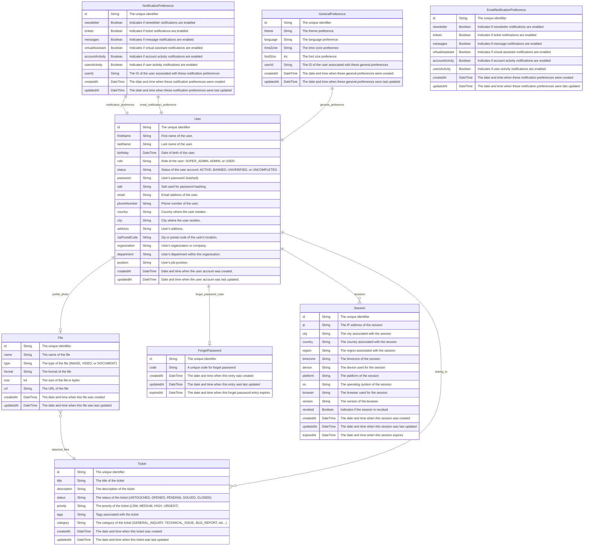

```mermaid
erDiagram
    NotificationPreference ||--|| User : notification_preference
    NotificationPreference ||--|| User : email_notification_preference
    GeneralPreference ||--|| User : general_preference
    File }o--|| Ticket : attached_files
    Ticket }o--|| User : belong_to
    User ||--o| ForgetPassword : forget_password_code
    User ||--o| File : profile_photo
    User ||--o{ Session : sessions


    ForgetPassword {
            id          String   "The unique identifier"
            code        String   "A unique code for forget password"
            createdAt   DateTime "The date and time when this entry was created"
            updatedAt   DateTime "The date and time when this entry was last updated"
            expiredAt   DateTime "The date and time when this forget password entry expires"
        }
        Session {
            id          String   "The unique identifier"
            ip          String   "The IP address of the session"
            city        String   "The city associated with the session"
            country     String   "The country associated with the session"
            region      String   "The region associated with the session"
            timezone    String   "The timezone of the session"
            device      String   "The device used for the session"
            platform    String   "The platform of the session"
            os          String   "The operating system of the session"
            browser     String   "The browser used for the session"
            version     String   "The version of the browser"
            revoked     Boolean  "Indicates if the session is revoked"
            createdAt   DateTime "The date and time when this session was created"
            updatedAt   DateTime "The date and time when this session was last updated"
            expiredAt   DateTime "The date and time when this session expires"
        }
    NotificationPreference {
        id               String   "The unique identifier"
        newsletter       Boolean  "Indicates if newsletter notifications are enabled"
        tickets          Boolean  "Indicates if ticket notifications are enabled"
        messages         Boolean  "Indicates if message notifications are enabled"
        virtualAssistant Boolean  "Indicates if virtual assistant notifications are enabled"
        accountActivity  Boolean  "Indicates if account activity notifications are enabled"
        usersActivity    Boolean  "Indicates if user activity notifications are enabled"
        userId           String   "The ID of the user associated with these notification preferences"
        createdAt        DateTime "The date and time when these notification preferences were created"
        updatedAt        DateTime "The date and time when these notification preferences were last updated"
        }
    EmailNotificationPreference {
        id               String   "The unique identifier"
        newsletter       Boolean  "Indicates if newsletter notifications are enabled"
        tickets          Boolean  "Indicates if ticket notifications are enabled"
        messages         Boolean  "Indicates if message notifications are enabled"
        virtualAssistant Boolean  "Indicates if virtual assistant notifications are enabled"
        accountActivity  Boolean  "Indicates if account activity notifications are enabled"
        usersActivity    Boolean  "Indicates if user activity notifications are enabled"
        createdAt        DateTime "The date and time when these notification preferences were created"
        updatedAt        DateTime "The date and time when these notification preferences were last updated"
    }
    GeneralPreference {
        id        String   "The unique identifier"
        theme     String   "The theme preference"
        language  String   "The language preference"
        timeZone  String   "The time zone preference"
        fontSize  Int      "The font size preference"
        userId    String   "The ID of the user associated with these general preferences"
        createdAt DateTime "The date and time when these general preferences were created"
        updatedAt DateTime "The date and time when these general preferences were last updated"
    }
    File {
        id        String   "The unique identifier"
        name      String  "The name of the file"
        type      String "The type of the file (IMAGE, VIDEO, or DOCUMENT)"
        format    String  "The format of the file"
        size      Int     "The size of the file in bytes"
        url       String   "The URL of the file"
        createdAt DateTime "The date and time when this file was created"
        updatedAt DateTime "The date and time when this file was last updated"
    }
    Ticket {
        id          String         "The unique identifier"
        title       String         "The title of the ticket"
        description String         "The description of the ticket"
        status      String   "The status of the ticket (UNTOUCHED, OPENED, PENDING, SOLVED, CLOSED)"
        priority    String "The priority of the ticket (LOW, MEDIUM, HIGH, URGENT)"
        tags        String         "Tags associated with the ticket"
        category    String "The category of the ticket (GENERAL_INQUIRY, TECHNICAL_ISSUE, BUG_REPORT, etc...)"
        createdAt   DateTime "The date and time when this ticket was created"
        updatedAt   DateTime        "The date and time when this ticket was last updated"
    }
    User {
        id          String         "The unique identifier"
        firstName              String                 "First name of the user."
        lastName               String                 "Last name of the user."
        birthday               DateTime               "Date of birth of the user."
        role                   String                "Role of the user: SUPER_ADMIN, ADMIN, or USER."
        status                 String              "Status of the user account: ACTIVE, BANNED, UNVERIFIED, or UNCOMPLETED."
        password               String                  "User's password (hashed)."
        salt                   String                  "Salt used for password hashing."
        email                  String                  "Email address of the user." 
        phoneNumber            String                 "Phone number of the user."
        country                String                 "Country where the user resides."
        city                   String                 "City where the user resides."
        address                String                 "User's address."
        zipPostalCode          String                 "Zip or postal code of the user's location."
        organization           String                 "User's organization or company."
        department             String                 "User's department within the organization."
        position               String                 "User's job position."
        createdAt              DateTime               "Date and time when the user account was created."
        updatedAt              DateTime                "Date and time when the user account was last updated."
    }

```
