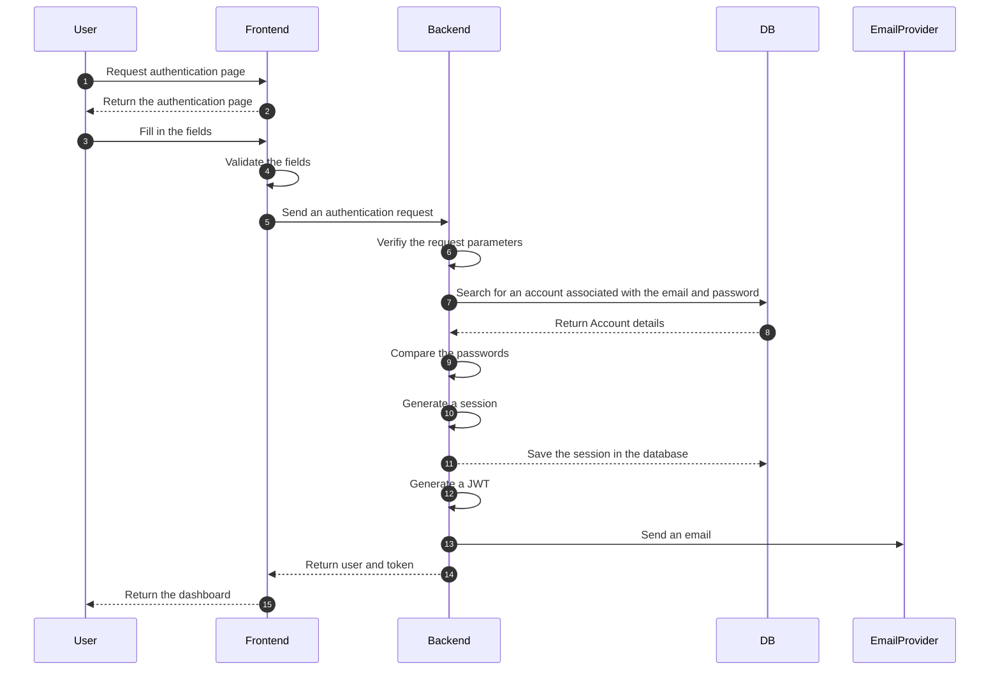

```mermaid
sequenceDiagram
    participant User
    participant Frontend
    participant Backend
    participant DB
    participant EmailProvider
    autonumber

    User ->> Frontend: Request authentication page
    Frontend -->> User: Return the authentication page

    User ->> Frontend: Fill in the fields
    Frontend ->> Frontend: Validate the fields
    Frontend ->> Backend: Send an authentication request
    Backend ->> Backend: Verifiy the request parameters
    Backend ->> DB: Search for an account associated with the email and password
    DB -->> Backend: Return Account details
    Backend ->> Backend: Compare the passwords
    Backend ->> Backend: Generate a session
    Backend -->> DB: Save the session in the database
    Backend ->> Backend: Generate a JWT
    Backend ->> EmailProvider: Send an email
    Backend -->> Frontend: Return user and token
    Frontend -->> User: Return the dashboard
```
