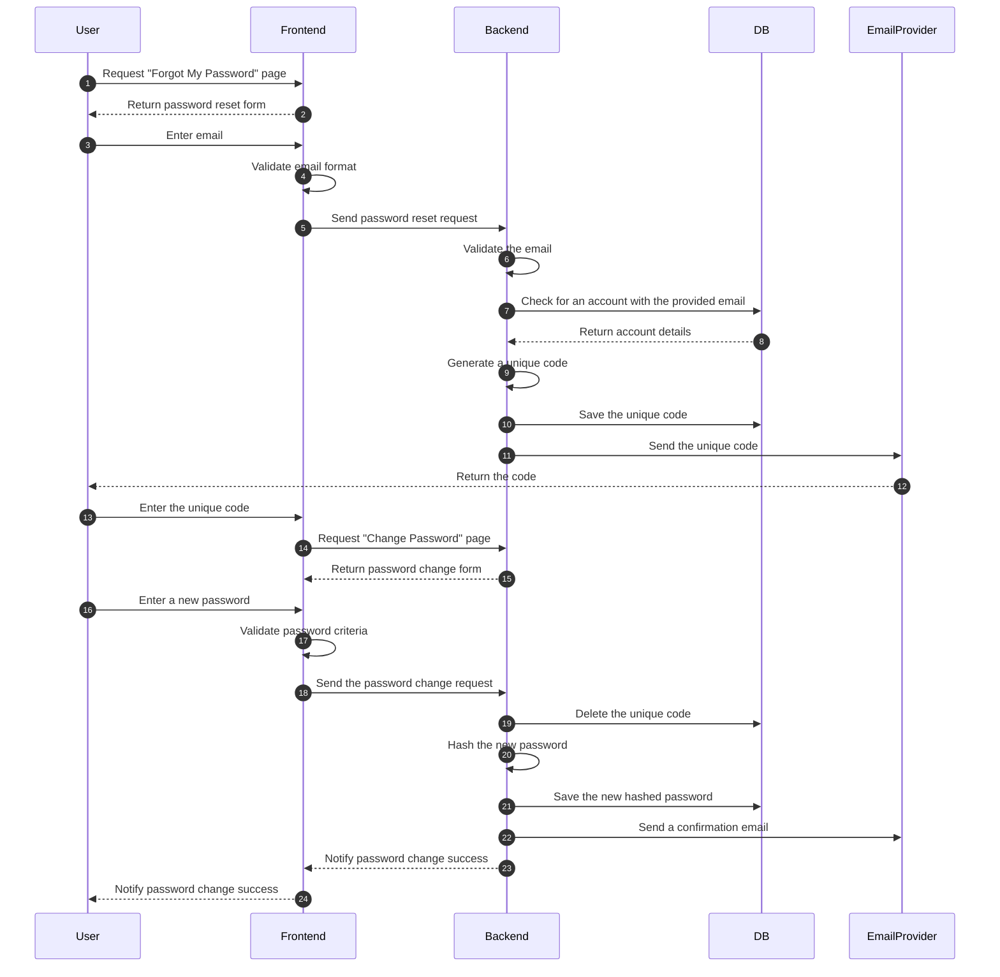

```mermaid
sequenceDiagram
    participant User
    participant Frontend
    participant Backend
    participant DB
    participant EmailProvider
    autonumber

    User ->> Frontend: Request "Forgot My Password" page
    Frontend -->> User: Return password reset form

    User ->> Frontend: Enter email
    Frontend ->> Frontend: Validate email format
    Frontend ->> Backend: Send password reset request
    Backend ->> Backend: Validate the email
    Backend ->> DB: Check for an account with the provided email
    DB -->> Backend: Return account details

    Backend ->> Backend: Generate a unique code
    Backend ->> DB: Save the unique code
    Backend ->> EmailProvider: Send the unique code
    EmailProvider -->> User: Return the code

    User ->> Frontend: Enter the unique code
    Frontend ->> Backend: Request "Change Password" page
    Backend -->> Frontend: Return password change form
    User ->> Frontend: Enter a new password
    Frontend ->> Frontend: Validate password criteria
    Frontend ->> Backend: Send the password change request
    Backend ->> DB: Delete the unique code
    Backend ->> Backend: Hash the new password
    Backend ->> DB: Save the new hashed password
    Backend ->> EmailProvider: Send a confirmation email
    Backend -->> Frontend: Notify password change success
    Frontend -->> User: Notify password change success
```