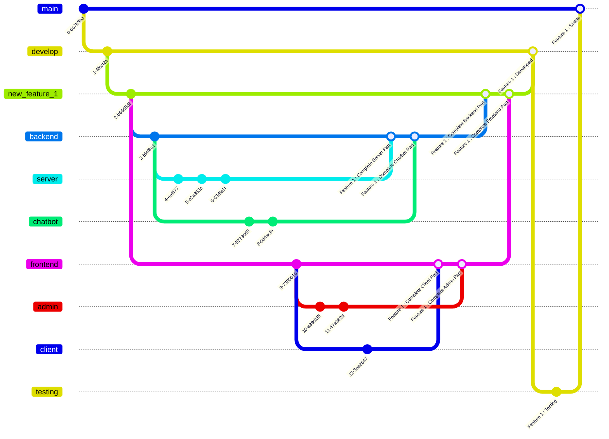

```mermaid
gitGraph
    commit
    branch develop
    checkout develop
    commit
    branch new_feature_1
    checkout new_feature_1
    commit
    checkout new_feature_1
    branch backend
    commit
    branch server
    commit
    commit
    commit
    checkout backend
    branch chatbot
    commit
    commit
    checkout new_feature_1
    branch frontend
    commit
    branch admin
    commit
    commit
    checkout frontend
    branch client
    commit
    checkout backend
    merge server id:"Feature 1 : Complete Server Part"
    merge chatbot id:"Feature 1 : Complete Chatbot Part"
    checkout frontend
    merge client id:"Feature 1 : Complete Client Part"
    merge admin id:"Feature 1 : Complete Admin Part"
    checkout new_feature_1
    merge backend id:"Feature 1 : Complete Backend Part"
    merge frontend id:"Feature 1 : Complete Frontend Part"
    checkout develop
    merge new_feature_1 id:"Feature 1 : Developed"
    branch testing
    commit id:"Feature 1 : Testing"
    checkout main
    merge testing id:"Feature 1 : Stable"

```
