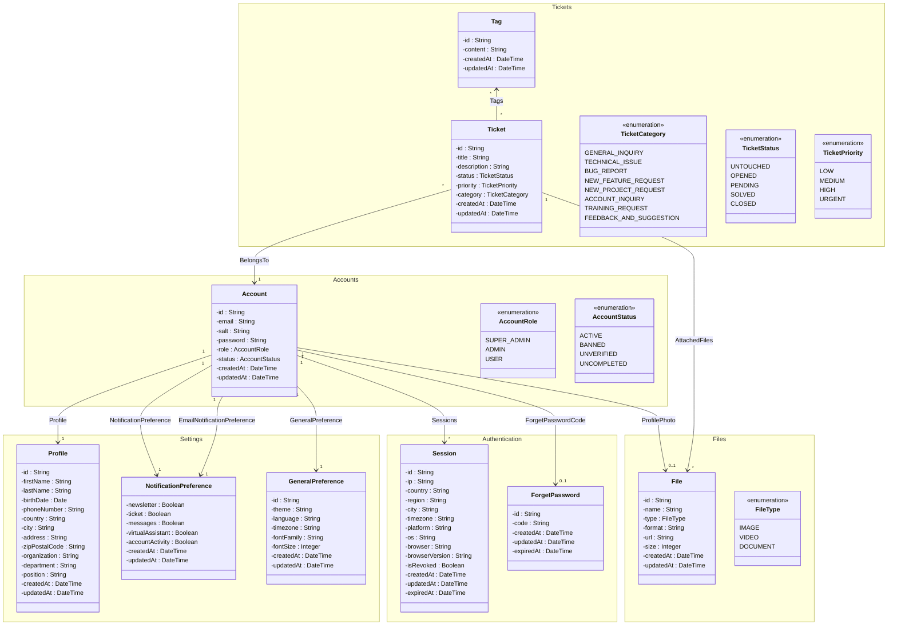

```mermaid
classDiagram
    Account "1" --> "1" Profile : Profile 
    Account "1" --> "1" NotificationPreference : NotificationPreference
    Account "1" --> "1" NotificationPreference : EmailNotificationPreference
    Account "1" --> "1" GeneralPreference : GeneralPreference
    Account "1" --> "*" Session : Sessions
    Account "1" --> "0..1" ForgetPassword : ForgetPasswordCode 
    Account "1" --> "0..1" File : ProfilePhoto
    Ticket "*"  --> "1" Account : BelongsTo 
    Ticket "1"  --> "*" File : AttachedFiles
    Tag "*" <-- "*" Ticket : Tags

    namespace Accounts {
        class Account{
            -id : String
            -email : String
            -salt : String
            -password : String
            -role : AccountRole
            -status : AccountStatus
            -createdAt : DateTime
            -updatedAt : DateTime
        }
        class AccountRole{
            <<enumeration>>
            SUPER_ADMIN
            ADMIN
            USER
        }
        class AccountStatus{
            <<enumeration>>
            ACTIVE
            BANNED
            UNVERIFIED
            UNCOMPLETED
        }
    }
    namespace   Tickets{
         class TicketCategory {
            <<enumeration>>
            GENERAL_INQUIRY
            TECHNICAL_ISSUE
            BUG_REPORT
            NEW_FEATURE_REQUEST
            NEW_PROJECT_REQUEST
            ACCOUNT_INQUIRY
            TRAINING_REQUEST
            FEEDBACK_AND_SUGGESTION
        }
        class TicketStatus {
            <<enumeration>>
            UNTOUCHED
            OPENED
            PENDING
            SOLVED
            CLOSED
        }
        class TicketPriority {
            <<enumeration>>
            LOW
            MEDIUM
            HIGH
            URGENT
        }
        class Ticket{
            -id : String
            -title : String
            -description : String
            -status : TicketStatus
            -priority : TicketPriority
            -category : TicketCategory
            -createdAt : DateTime
            -updatedAt : DateTime
        }
       
        class Tag{
            -id : String
            -content : String
            -createdAt : DateTime
            -updatedAt : DateTime
        }
    }
    namespace Settings {
        class Profile{
            -id : String
            -firstName : String
            -lastName : String
            -birthDate : Date
            -phoneNumber : String
            -country : String
            -city : String
            -address : String
            -zipPostalCode : String
            -organization : String
            -department : String
            -position : String
            -createdAt : DateTime
            -updatedAt : DateTime
        }
        class NotificationPreference {
            -newsletter : Boolean
            -ticket : Boolean
            -messages : Boolean
            -virtualAssistant : Boolean
            -accountActivity : Boolean
            -createdAt : DateTime
            -updatedAt : DateTime
        }
        class GeneralPreference{
            -id : String
            -theme : String
            -language : String
            -timezone : String
            -fontFamily : String
            -fontSize : Integer
            -createdAt : DateTime
            -updatedAt : DateTime
        }
    }
    namespace Authentication{
        class Session{
            -id : String
            -ip : String
            -country : String
            -region : String
            -city : String
            -timezone : String
            -platform : String
            -os : String
            -browser : String
            -browserVersion : String
            -isRevoked : Boolean
            -createdAt : DateTime
            -updatedAt : DateTime
            -expiredAt : DateTime
        }
        class ForgetPassword{
            -id : String
            -code : String
            -createdAt : DateTime
            -updatedAt : DateTime
            -expiredAt : DateTime
        }
    }
    namespace Files{
        class FileType {
            <<enumeration>>
            IMAGE
            VIDEO
            DOCUMENT
        }
        class File{
            -id : String
            -name : String
            -type : FileType
            -format : String
            -url : String
            -size : Integer
            -createdAt : DateTime
            -updatedAt : DateTime
        }
    }
```
